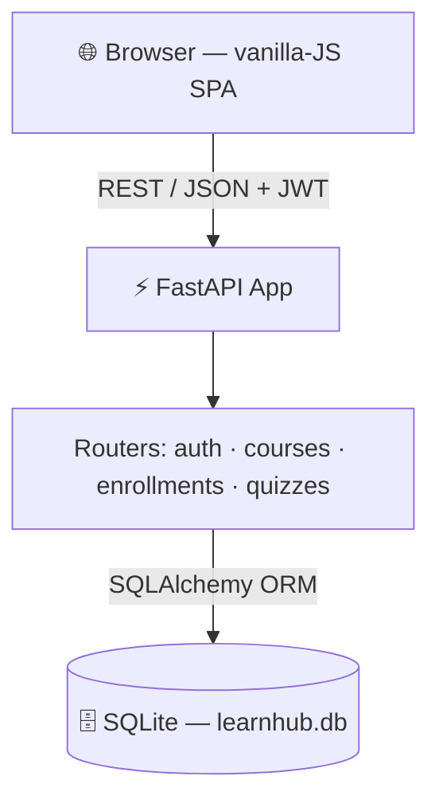

<div align="center">

# 🎓 LearnHub

### Online Learning Platform

*Where instructors publish courses and learners enroll, track progress, and prove mastery with auto-graded quizzes.*

<br/>

[](https://www.python.org/)
[](https://fastapi.tiangolo.com/)
[](https://www.sqlalchemy.org/)
[](https://www.sqlite.org/)
[](https://jwt.io/)
[](https://developer.mozilla.org/docs/Web/JavaScript)

<br/>

**Tech Stack**


<br/>

[](https://github.com/Rajkoli143/LearnHub)
&nbsp;

&nbsp;


</div>

> **GitHub Repository:** `https://github.com/Rajkoli143/LearnHub` &nbsp;

---

## 📌 Project Overview

LearnHub is a modular **FastAPI** service over **SQLAlchemy + SQLite**, paired with a lightweight
**vanilla-JS** frontend in a *Bold &amp; Creative* theme. The architecture cleanly separates four
concerns so each can scale and evolve independently.

<table>
<tr><td><b>🏷️ Domain</b></td><td>E-learning / EdTech</td></tr>
<tr><td><b>⚙️ Backend</b></td><td>Python 3.11+, FastAPI, SQLAlchemy ORM</td></tr>
<tr><td><b>🗄️ Database</b></td><td>SQLite (file-based; Postgres-ready)</td></tr>
<tr><td><b>🔐 Auth</b></td><td>JWT (PyJWT) + PBKDF2 hashing, role-based access</td></tr>
<tr><td><b>🎨 Frontend</b></td><td>HTML + CSS + vanilla JavaScript (no build step)</td></tr>
<tr><td><b>📖 API Docs</b></td><td>Auto-generated Swagger UI at <code>/docs</code></td></tr>
</table>

### ✅ Core Modules (fully implemented)

| Module | What it does |
|:--|:--|
| 🔐 **Auth** | register, login, JWT sessions, roles (learner / instructor / admin) |
| 📚 **Courses** | CRUD for courses, sections, and lessons; public search + filter |
| 🎟️ **Enrollment** | enroll, list "My Learning", update lesson progress |
| 📝 **Quizzes** | instructor authoring, server-side auto-scoring, attempt limits |

### 🧩 Stubbed (documented as Future Scope)

> Payments (Razorpay) · media/CDN upload · full-text search ranking · recommendation engine · background task queue · email/OTP service

---

## 🏛️ Architecture



> Detailed architecture, flow, and ER diagrams live in [`learnhubdiagrams/`](https://excalidraw.com/#json=84BUzMuQun2fK3pBs09Rl,zZSatXRwCkbacMI8ZnIGnQ).

---

## 📦 Dependencies

Listed in [`backend/requirements.txt`](./backend/requirements.txt):

| Package | Role |
|:--|:--|
| `fastapi` | web framework |
| `uvicorn` | ASGI server |
| `SQLAlchemy` | ORM |
| `PyJWT` | JWT auth tokens |
| `pydantic[email]` | request/response validation |

> 🔒 Password hashing uses the standard-library `hashlib` (PBKDF2) — **no native build dependencies**.

---

## 🛠️ Setup Instructions

```bash
# 1. Go to the backend
cd backend

# 2. Create and activate a virtual environment
python3 -m venv .venv
source .venv/bin/activate        # Windows: .venv\Scripts\activate

# 3. Install dependencies
pip install -r requirements.txt

# 4. Seed demo data (creates learnhub.db with sample courses/users/quiz)
python seed.py
```

---

## ▶️ Execution Steps

```bash
# From the backend/ directory, with the venv active:
uvicorn app.main:app --reload
```

Then open:

| URL | What |
|:--|:--|
| <http://127.0.0.1:8000/> | 🎨 **Web app** (frontend) |
| <http://127.0.0.1:8000/docs> | 📖 **Swagger API docs** (interactive) |
| <http://127.0.0.1:8000/api/health> | ❤️ Health check |

### 👤 Demo accounts &nbsp;<sub>(password: `Passw0rd!`)</sub>

| Email | Role |
|:--|:--|
| `learner@learnhub.dev` | learner *(pre-enrolled in a course)* |
| `instructor@learnhub.dev` | instructor *(owns the sample courses)* |
| `admin@learnhub.dev` | admin |

### 🚀 Try it
1. Open `/` → browse the **Course Catalog**.
2. **Login** as the learner → **My Learning** shows progress.
3. Open *Python for Beginners* → **Take Quiz** → submit → see auto-graded score.
4. Login as the **instructor** → **+ Course** to create one, **+ Add Quiz** to author questions.

---

## 🔗 API Reference

| Method | Path | Module | Auth |
|:--:|:--|:--|:--:|
| `POST` | `/api/auth/register` | Auth | — |
| `POST` | `/api/auth/login` | Auth | — |
| `GET` | `/api/auth/me` | Auth | 🔑 JWT |
| `GET` | `/api/courses?q=&category=` | Courses | — |
| `GET` | `/api/courses/{id}` | Courses | — |
| `POST` | `/api/courses` | Courses | 🛡️ instructor/admin |
| `POST` | `/api/courses/{id}/sections` | Courses | 🛡️ owner |
| `POST` | `/api/courses/sections/{id}/lessons` | Courses | 🛡️ owner |
| `POST` | `/api/enrollments/{course_id}` | Enrollment | 🔑 JWT |
| `GET` | `/api/enrollments` | Enrollment | 🔑 JWT |
| `PATCH` | `/api/enrollments/{id}/progress` | Enrollment | 🔑 JWT |
| `POST` | `/api/courses/{id}/quizzes` | Quizzes | 🛡️ owner |
| `GET` | `/api/quizzes/{id}` | Quizzes | 🔑 JWT |
| `POST` | `/api/quizzes/{id}/submit` | Quizzes | 🔑 JWT |

---

## 🗂️ Project Structure

```
LearnHub/
├── backend/
│   ├── app/
│   │   ├── main.py          # FastAPI app, router wiring, static serving
│   │   ├── database.py      # engine, session, Base
│   │   ├── models.py        # SQLAlchemy ORM models (10 tables)
│   │   ├── schemas.py       # Pydantic request/response schemas
│   │   ├── auth.py          # password hashing + JWT + role guards
│   │   └── routers/
│   │       ├── auth.py
│   │       ├── courses.py
│   │       ├── enrollments.py
│   │       └── quizzes.py
│   ├── seed.py              # demo data loader
│   └── requirements.txt
├── frontend/
│   ├── index.html
│   ├── style.css
│   └── app.js               # vanilla-JS SPA
├── learnhubdiagrams/        # architecture, flow & ER diagrams
├── docs/                    # project documentation PDF + builder
└── README.md
```

---

## 🔭 Future Scope
- 💳 Razorpay payment gateway + webhook-confirmed paid enrollment
- 🎬 Media uploads to S3/CDN with presigned URLs and video streaming
- 🐘 PostgreSQL + Alembic migrations; full-text search (`tsvector`) with ranking
- 🤖 ML recommendation engine (scikit-learn) and personalized course feed
- 📨 Celery task queue for emails, certificate generation, analytics
- 📧 Email / OTP verification and password reset

---

<div align="center">
<sub>FastAPI ⚡ · SQLAlchemy 🗄️ · vanilla JS 🎨</sub>

</div>
